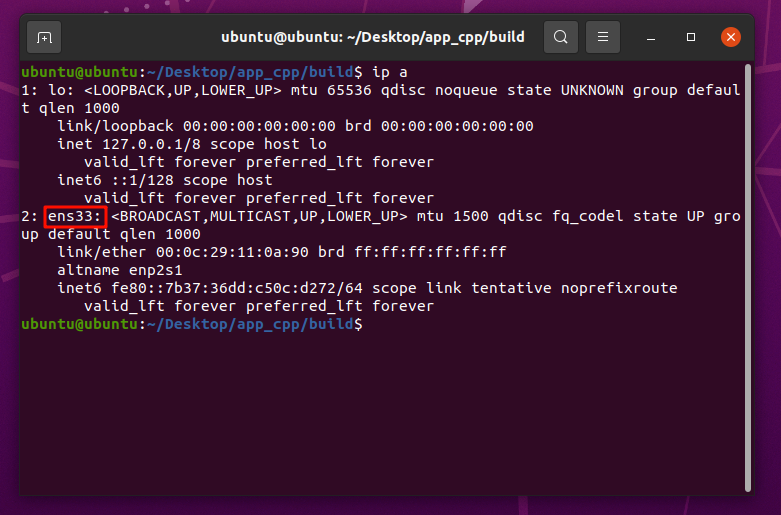
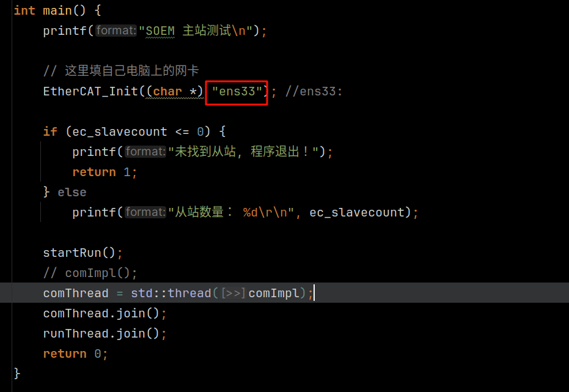
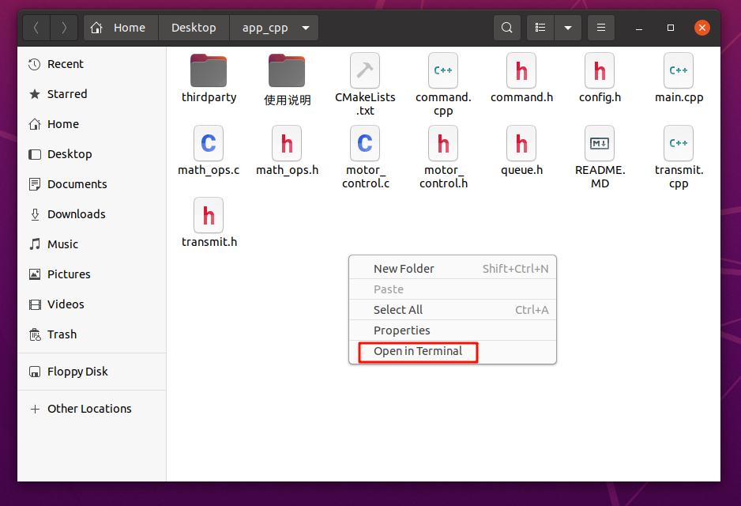
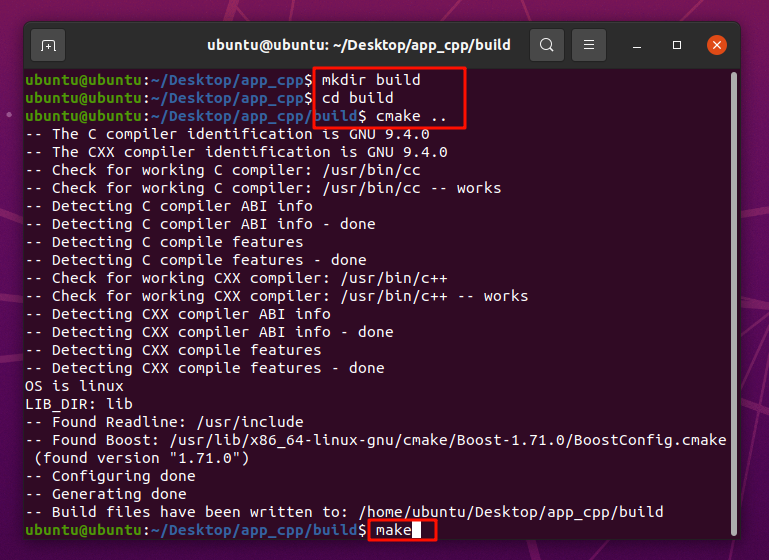
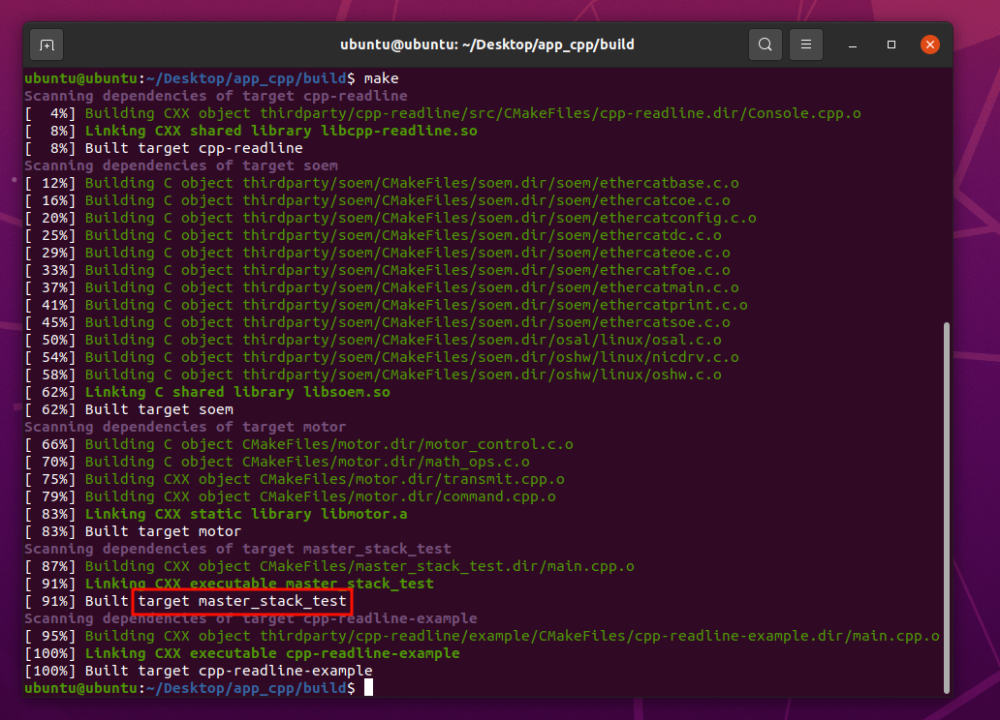
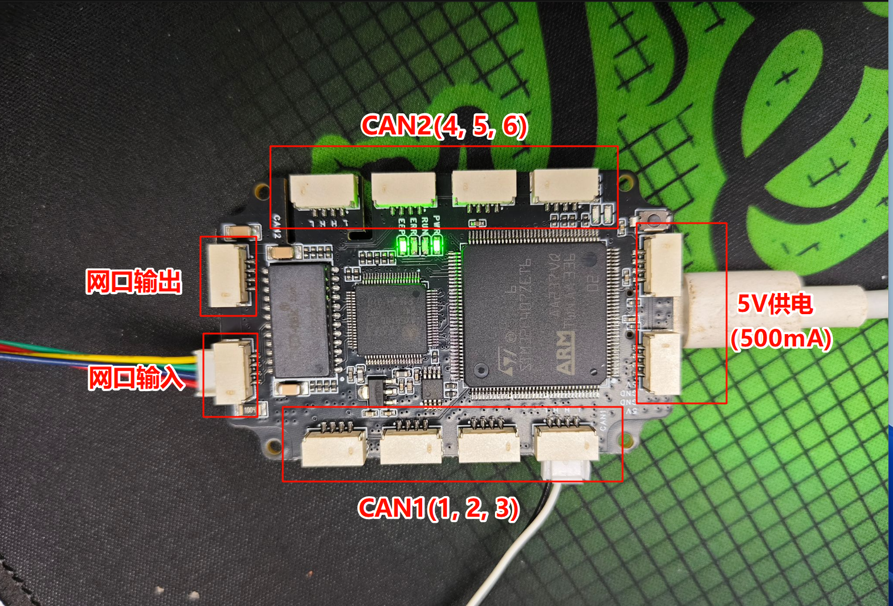
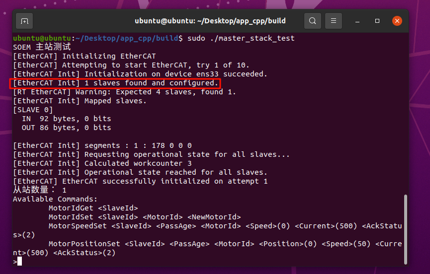
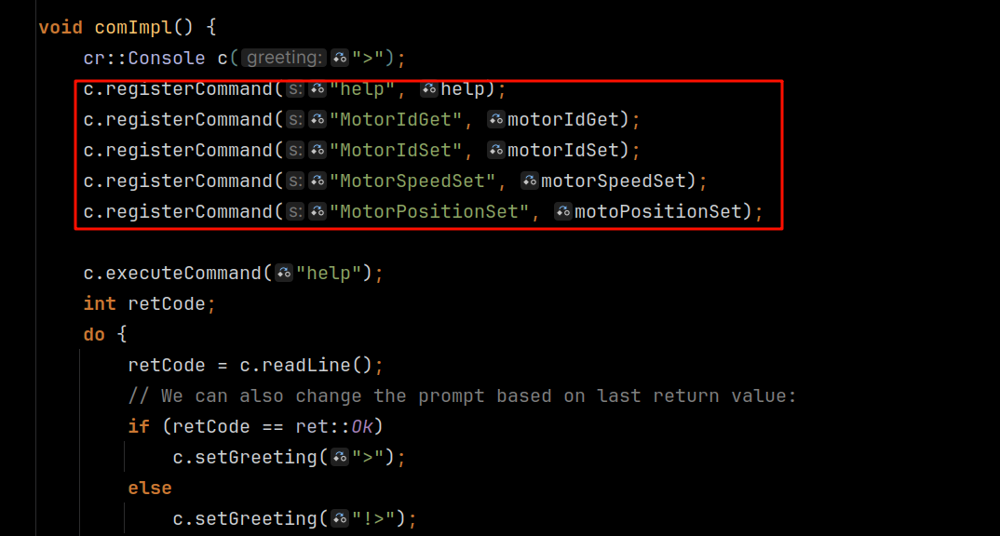
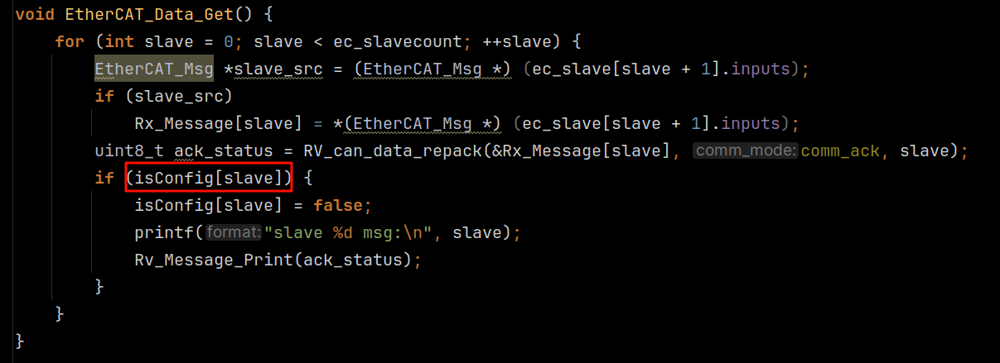
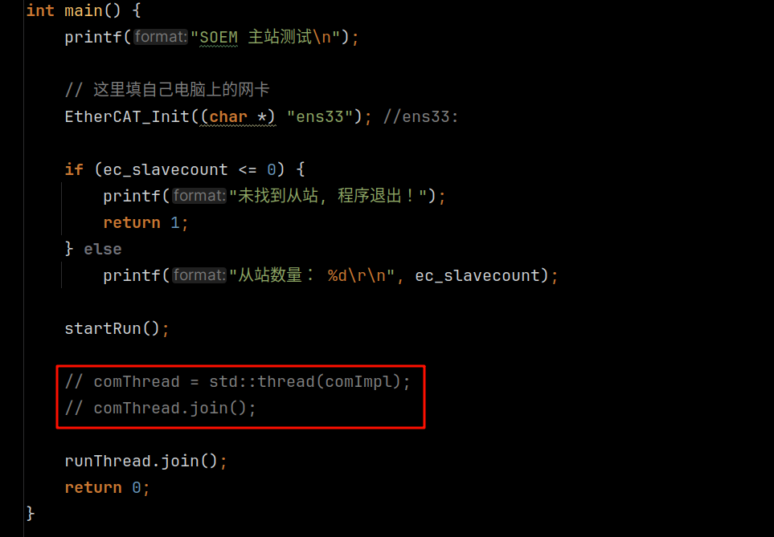

## 环境

操作系统：`Ubuntu20.04`

编译工具：`g++`、`cmake`
```bash
# 安装g++
sudo apt install g++
# 安装cmake
sudo apt install cmake
```

依赖包：

- Readline库，该库用于从终端读取用户输入。
- Boost库，提供高效数据传输。
```bash
# 安装Readline库
sudo apt install libreadline-dev
# 安装Boost库
sudo apt install libboost-all-dev
```

## 查看网卡

打开终端，输入`ip a`查看网卡名称。



> 注意：lo为本地回环接口，ens33为网卡名称

将网卡名称填入`main.cpp`中



## 编译工程

进入项目目录，鼠标右键，选择在终端中打开（Open in Terminal）



输入以下命令

```bash
# 创建build目录
mkdir build
# 进入build目录
cd build
# 配置工程
cmake ..
# 编译工程
make
```


按下回车后开始编译



编译完成后，`master_stack_test`就是编译完成的程序了

## 启动程序

启动程序前需要先连接从站，具体操作查看`EtherCat-CAN转接板说明文档.pdf`



示例程序使用CAN1，网口输入需要连接电脑网口，请尽量使用Ubuntu系统，如果使用虚拟机，网络适配器请使用<mark>桥接模式</mark>。

输入以下命令启动程序
```bash
sudo ./master_stack_test
```
由于soem使用到了原始套接字，该程序必须以root权限运行，也可以使用setcap为本程序单独赋予原始套接字权限，可以参考[这篇文章](https://squidarth.com/networking/systems/rc/2018/05/28/using-raw-sockets.html)



soem主站运行成功

### 如何使用

本测试程序具备读取/设置电机ID、设置电机为速度伺服控制/位置伺服控制的功能。
- 启动程序后在启动程序后，可以通过tab补全程序内部指令，上下键切换历史指令，其他快捷键与bash快捷键相同
- 具体可以使用的指令有（括号中为默认值），参数具体含义可以参考电机使用说明书
    - MotorIdGet \<SlaveId\>
    - MotorIdSet \<SlaveId\> \<MotorId\> \<NewMotorId\>
    - MotorIdReset \<SlaveId\>
    - MotorZeroSet \<SlaveId\> \<PassAge\> \<MotorId\>
    - MotorStop \<SlaveId\> \<PassAge\> \<MotorId\>
    - MotorSpeedSet \<SlaveId\>\<PassAge> \<MotorId\> \<Speed\>(0) \<Current\>(500) \<AckStatus\>(2)
    - MotorPositionSet \<SlaveId\>\<PassAge> \<MotorId\> \<Position\>(0) \<Speed\>(50) \<Current\>(500) \<AckStatus\>(2)

> 注意：SlaveId从0开始，即第一个从站SlaveId为0，第二个从站SlaveId为1，以此类推第n个从站的SlaveId为n-1。

## 二次开发

所有对电机的操作均在`transmit.cpp`中的`EtherCAT_Command_Set`函数中完成。

其整个控制流程为先将控制命令填充到`ec_slave[slave + 1].outputs`中，然后再发送数据包。而`EtherCAT_Command_Set`函数的作用就是填充控制命令。详情查看`EtherCAT_Run`函数的实现。

### 命令控制

本测试例程采用命令的方式控制电机，如果需要添加其他命令，请参考`command.cpp`的命令回调函数的实现。实现完回调函数后，在`main.cpp`的`comImpl`函数中添加命令注册函数



`EtherCAT_Command_Set`函数的实现如下：
```c++
void EtherCAT_Command_Set() {
    static int state[SLAVE_NUMBER];
    for (int slave = 0; slave < ec_slavecount; ++slave) {
        Queue_Msg_ptr msg;
        if (state[slave] == 0) {
            if (messages[slave].pop(msg)) {
                Tx_Message[slave].motor[msg->passage - 1] = msg->motor;
                state[slave] = 1;
            }
        } else if (state[slave]++ == 10) {
            isConfig[slave] = true;
            state[slave] = 0;
        }

        EtherCAT_Msg *slave_dest = (EtherCAT_Msg *) (ec_slave[slave + 1].outputs);
        if (slave_dest)
            *(EtherCAT_Msg *) (ec_slave[slave + 1].outputs) = Tx_Message[slave];
    }
}
```

使用了一个简单状态机，当收到新的命令时，先将需要发送数据填充到`Tx_Message`中，再将数据发送给从站。<mark>如果没有新的命令填充到`Tx_Message`中，则会一直循环发送上一次填充的数据</mark>。
而向从机发送数据时，从机不能马上返回数据到主机，因此需要等待从机响应数据，这里等待10个周期（可以根据实际情况调整，在这10个周期内，主机一直向从机发送上一条指令），10个周期之后，设置`isConfig[slave]`为true，表示从机配置完成，返回数据可用，可以开始读取数据。

`isConfig`在本例程中的位置为`transmit.cpp`中的`EtherCAT_Data_Get`函数中
，其用来控制是否打印数据



### 直接控制

直接控制相对比较简单，只需要调用`motor_control.c`中的函数即可。

如果需要从本例程改成直接控制，首先需要将`main.cpp`中的`main`函数的输入命令的线程去掉，如



然后修改`EtherCAT_Command_Set`，如
```c++
// 直接代码控制电机的例程（只有一个从站控制一个电机）
void EtherCAT_Command_Set() {
    static int state;

    int slave = 0;

    if (state == 0) {
        // 设置零点
        MotorSetting(&Tx_Message[slave], 2, 0x03);
        state = 1;
    } else {
        // 设置电机位置
        set_motor_position(&Tx_Message[slave], 1, 2, 180.0f, 100, 40, 0);
    }

    EtherCAT_Msg *slave_dest = (EtherCAT_Msg *) (ec_slave[slave + 1].outputs);
    if (slave_dest)
        *(EtherCAT_Msg *) (ec_slave[slave + 1].outputs) = Tx_Message[slave];
}
```

上面程序实现的效果是控制在CAN1上面Id为2的电机旋转180°。

如果只有一个从站的话，可以不需要slave这个变量，直接把slave换成0就可以了。但为了和下面代码的一致性，所以使用才使用了这个变量。

> 注意：在一个周期中不能执行passage(可以理解为从站上面挂载电机的编号）相同的指令，从函数的实现上就能分析出最后一条指令会覆盖之前的指令。

一个从站控制多个电机的例程：

```c++
void EtherCAT_Command_Set() {
    static int state;
    
    int slave = 0; 

    set_motor_speed(&Tx_Message[slave], 1, 1, 20, 100, 0);  
    set_motor_speed(&Tx_Message[slave], 2, 3, 30, 100, 0);  
    set_motor_speed(&Tx_Message[slave], 3, 5, 40, 100, 0);  
    set_motor_speed(&Tx_Message[slave], 4, 7, 50, 100, 0);  
    set_motor_speed(&Tx_Message[slave], 5, 9, 60, 100, 0);  
    set_motor_speed(&Tx_Message[slave], 6, 11, 70, 100, 0);  
    
    EtherCAT_Msg *slave_dest = (EtherCAT_Msg *) (ec_slave[slave + 1].outputs);
    if (slave_dest)
        *(EtherCAT_Msg *) (ec_slave[slave + 1].outputs) = Tx_Message[slave];

}
```

上面的代码分别控制电机ID为1、3、5、7、9、11的速度为20、30、40、50、60、70。1、3、5的电机在CAN1（1、2、3）上，7、9、11的电机在CAN2（4、5、6）上。

多个从站控制多个电机的例程：

```c++
void EtherCAT_Command_Set() {
    static int state[SLAVE_NUMBER];

    // ec_slavecount为主机识别到从机的数量。
    for (int slave = 0; slave < ec_slavecount; ++slave) {

        if (slave == 0) {           // 第一个从站，和一个从站控制多个电机一样
            set_motor_speed(&Tx_Message[slave], 1, 1, 20, 100, 0);
            set_motor_speed(&Tx_Message[slave], 2, 2, 30, 100, 0);
            // 其他电机的操作...
        } else if (slave == 1) {    // 第二个从站
            if (state[slave] == 0) {
                // 设置零点
                MotorSetting(&Tx_Message[slave], 3, 0x03);
                state[slave] = 1;
            } else {
                // 设置电机位置
                set_motor_position(&Tx_Message[slave], 1, 1, 180.0f, 100, 40, 0);
            }
        } // 如果还有其他从站...

        EtherCAT_Msg *slave_dest = (EtherCAT_Msg *) (ec_slave[slave + 1].outputs);
        if (slave_dest)
            *(EtherCAT_Msg *) (ec_slave[slave + 1].outputs) = Tx_Message[slave];
    }
}
```

上面例程的效果是第一个从站的CAN1上面ID为1、2的电机的速度为20、30，第二个从站的CAN1上面ID为1的电机旋转180°。

为了使程序可读性更高，可以将控制电机的操作封装成函数，比如

```c++
void MotorControl(EtherCAT_Msg * msg, int slave) {
    if (slave == 0) {           // 第一个从站，和一个从站控制多个电机一样
        set_motor_speed(msg, 1, 1, 20, 100, 0);
        set_motor_speed(msg, 2, 2, 30, 100, 0);
        // 其他电机的操作...
    } else if (slave == 1) {    // 第二个从站
        if (state[slave] == 0) {
            // 设置零点
            MotorSetting(msg, 3, 0x03);
            state[slave] = 1;
        } else {
            // 设置电机位置
            set_motor_position(msg, 1, 1, 180.0f, 100, 40, 0);
        }
    } // 如果还有其他从站...
}

void EtherCAT_Command_Set() {
    static int state[SLAVE_NUMBER];

    // ec_slavecount为主机识别到从机的数量。
    for (int slave = 0; slave < ec_slavecount; ++slave) {

        MotorControl(&Tx_Message[slave], slave);

        EtherCAT_Msg *slave_dest = (EtherCAT_Msg *) (ec_slave[slave + 1].outputs);
        if (slave_dest)
            *(EtherCAT_Msg *) (ec_slave[slave + 1].outputs) = Tx_Message[slave];
    }
}
```
